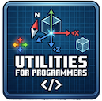
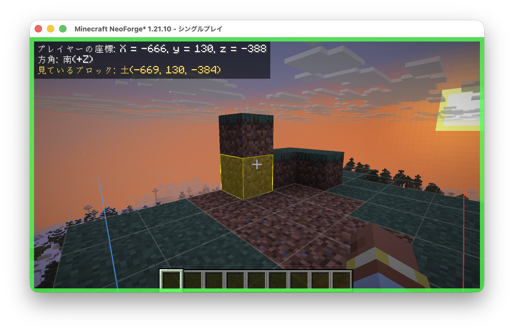

<div align="center">



# UtilitiesForProgrammers

**Minecraft の中でプログラミング学習を支援する、クライアントサイド専用 MOD**

[](https://www.minecraft.net/)
[](https://neoforged.net/)
[](https://adoptium.net/)
[](LICENSE)

座標・方角の可視化、ブロック更新のハイライト、原点基準の座標軸グリッド、
他ウィンドウと並行作業するためのウィンドウ操作機能を提供します。



</div>

---

## ✨ 特長

| 機能 | 説明 |
| --- | --- |
| 🧭 **HUD** | 絶対座標・向いている方角・視線の先のブロック情報（ブロックID＋ブロックステート）を画面左上に表示 |
| 🟥 **ブロック更新ハイライト** | サーバーから届くブロック更新を配置順に色分け（新しい＝赤 → 古い＝青）し、時間で薄くフェードアウト |
| 🎯 **ターゲットハイライト** | 視線の先のブロックを、バニラより強調した枠線＋半透明フィルで表示 |
| 📐 **座標軸グリッド** | プレイヤー周囲に1ブロック単位のグリッドを投影。**原点 (0,0,0) を基準**とした座標軸の矢印（**+X = 赤 / +Z = 青**）を **Y=0 平面**に固定描画 |
| 🪟 **ウィンドウ操作** | 非フォーカス時も描画継続・画面端のフォーカス枠表示・常に最前面・外部操作モード（後述） |

> 🌐 **クライアントサイド専用** — サーバー側へのインストールは不要です。
> ブロック更新の検知は client packet listener への mixin で行うため、**バニラ（MOD 無し）サーバーでも動作**します。

---

## ⌨️ 操作キー

初期割り当てはバニラ 1.21.10 で**未使用のキー**を選んでいるため、通常の操作と競合しません。
すべて **オプション > 操作設定** から変更できます。

| キー | 機能 |
| :---: | --- |
| <kbd>H</kbd> | **MOD の全機能を一括で ON / OFF**（HUD・各ハイライト・グリッド・フォーカス枠・最前面） |
| <kbd>K</kbd> | **外部操作モード**の切り替え |

### 外部操作モード（<kbd>K</kbd>）

エディタなど他のウィンドウで作業しながら Minecraft を参照するためのモードです。有効にすると:

- 🖱️ マウスカーソルを解放し、他ウィンドウを操作可能に
- 🚶 プレイヤーの移動入力を停止
- ⛏️ **クリック操作（破壊・設置・攻撃・ピック）を無効化**（誤操作の防止）
- ❄️ HUD の値とハイライトの経過時間を静止（コピー・観察しやすく）

---

## ⚙️ 設定

各機能の有効/無効や、ハイライトの色・表示時間・グリッドの広さなどは設定ファイルで調整できます。

```
config/utilitiesforprogrammers-client.toml
```

ゲーム内の設定画面、またはファイル編集で変更でき、**再起動なし**で反映されます。

---

## 📦 動作要件

- Minecraft **1.21.10**
- NeoForge **21.10.x**
- JDK **21**（ソースからビルドする場合）

---

## 🔨 ビルド

```bash
./gradlew build
```

生成された jar は `build/libs/` に出力されます。

## ▶️ 開発用クライアントの起動

```bash
./run-client.sh
```

初回はゲームアセットのダウンロードに数分かかります（以降は高速）。
オフラインの開発用アカウントを使用するため、シングルプレイでの動作確認用です。

---

## 📄 ライセンス

[MIT](LICENSE) © Yu Osada
